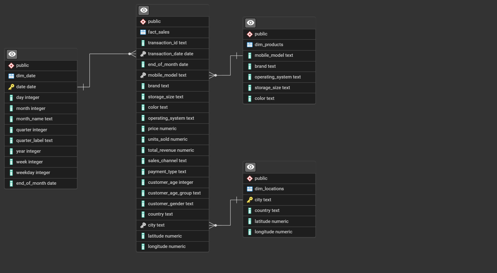
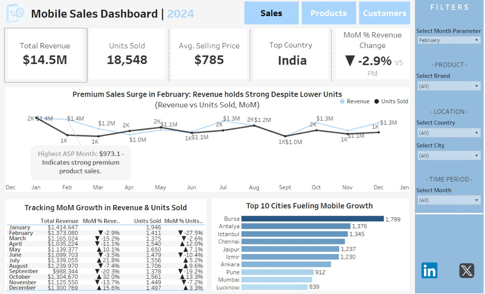

# Mobile-Sales-Analysis

## Project Background
Mobile Sales Dashboard is a data analysis project focused on uncovering key insights from a comprehensive 2024 sales dataset provided by a major mobile phone retailer operating across multiple countries. The company, whose name remains undisclosed, offers mobile phones through various sales channels including in-store purchases, online platforms, and third-party partners.

The dataset includes detailed records of transactions, customer demographics, product specifications, and geographic data. It captures valuable information such as device models, prices, storage sizes, colors, operating systems, customer age groups and genders, as well as sales channels and payment methods.

This project aims to analyze and visualize this data to identify trends, highlight high-performing products, and provide a deeper understanding of customer behavior. The resulting insights are intended to support strategic business decisions related to marketing, inventory management, and regional expansion.

Insights and recommendations are provided on the following key areas:
- **Sales Trends & Channel Performance:** Examination of sales activity across different channels (online, in-store, partner) and time periods, with a focus on revenue, volume, and seasonal patterns.
- **Product Performance Analysis:** Assessment of mobile phone models based on price, storage size, color, and operating system to determine the best and worst-performing products.
- **Customer Behavior Insights:** Analysis of customer demographics, including age group and gender, to uncover purchasing patterns and segment preferences.
- **Regional Sales Breakdown:** Evaluation of geographic trends to identify top-performing regions and potential markets for growth.

An interactive Tableau dashboard used to report and visualize these findings and support data-driven business strategies can be found here: 
[Mobile Sales Dashboard | 2024](https://public.tableau.com/views/MobileSalesDashboard2024/SalesDashboard?:language=en-US&:sid=&:redirect=auth&:display_count=n&:origin=viz_share_link)

### Data Structure & Initial Checks
The company's main database structure as seen below, consists of one facts table, facts_sales, and 2 dimension tables: dim_products and dim_location, with a total row count of 367 records.

#### Entity Relationship Diagram

Prior to beginning the analysis, a variety of checks were conducted for quality control and farmilarization with the dataset.

## Executive Summary
### Overview of Findings
In 2024, the company’s mobile sales showed mixed performance, with steady overall revenue but notable fluctuations in monthly trends and unit sales. Key performance indicators (KPIs) reflect a competitive market influenced by consumer preference for premium devices and regional growth hotspots.

Total revenue for the year reached $14.5M, with 18,548 units sold at an average selling price (ASP) of $785. While overall performance was stable, a closer look at monthly data reveals critical insights.

Regionally, **India emerged as the top-performing country**, while **Bursa**, **Antalya**, and **Istanbul** led city-level mobile growth, collectively accounting for a significant share of total units sold.

Despite a **-2.9% MoM revenue dip in February**, revenue remained strong due to high-value sales. This trend underscores the importance of targeting premium segments in high-performing regions.

Below is the overview page from the Tableau dashboard and more examples are included throughout the report. The entire interactive dashboard can be downloaded [here](https://public.tableau.com/views/MobileSalesDashboard2024/SalesDashboard?:language=en-US&:sid=&:redirect=auth&:display_count=n&:origin=viz_share_link)

### Sales Performance:
- 🔍Premium Sales Surge in February — Revenue Held Strong Despite Lower Units
In **February 2024**, the business saw a standout trend: **mobile unit sales dropped sharply by 27.5%**, falling from **1,946 units in January to 1,411**, the **lowest monthly volume of the year**. Yet, **total revenue held nearly steady at $1.37M**, down just **2.9% from January’s $1.41M**. This anomaly signals a **significant spike in Average Selling Price (ASP)**, which reached **$973.10** — the **highest ASP of the year**.

This trend highlights a **shift toward high-end device purchases**, suggesting that targeted promotions, flagship product launches, or premium customer segments drove revenue despite declining volume.

📊 Supporting Evidence:
- **January vs February:**
  - Revenue: $1.41M → $1.37M (▼ 2.9%)
  - Units Sold: 1,946 → 1,411 (▼ 27.5%)
  - ASP ↑ to $973.10 — highest of the year

- **Compared to March:**
  - Revenue fell further to $1.17M (▼ 15.2%)
  - Units sold: 1,375 (▼ only 2.6%)
  - Suggests February was uniquely driven by **premium product sales**

- **October also saw a similar ASP-driven pattern:**
  - Revenue ↑ 32.0% while Units ↓ 13.3%
  - Another example of revenue growth not tied to higher volume

💡 **Takeaway:**
**Premium device sales can protect revenue even in low-volume months.** Replicating February’s success may involve:
- Releasing flagship models in Q1
- Offering high-margin bundles or loyalty upgrades
- Segmenting campaigns toward high-ASP demographics

Revenue holds strong despite February's unit dip — driven by premium device sales.

February's MoM drop in units sold contrasts with minimal revenue decline — ASP peaked at $973.10.

- 🌍Regional Growth Spotlight: Cities Driving Mobile Sales
In 2024, mobile growth was largely driven by **urban powerhouses** across **Turkey** and **India**, with **Bursa leading all cities at 1,799 units sold**. Turkish cities dominated the leaderboard, securing **6 of the top 10 spots**, led by **Antalya (1,376)** and **Istanbul (1,345)** — highlighting a strong regional presence and possibly effective localized marketing or distribution strategies.

India also contributed significantly, with **Chennai (1,296)**, **Jaipur (1,237)**, and **Pune (912)** showing impressive sales volumes. This geographic trend signals high market penetration in metros and growing adoption in Tier-2 cities like **Lucknow (839)**.

💡 **Takeaway:**
To sustain growth, the business can:
- Double down on high-performing Turkish cities with targeted promotions
- Expand presence in Indian Tier-2 cities, where mobile demand is surging
- Analyze what’s working in Bursa and replicate those strategies in underperforming cities

Bursa leads the charge in mobile sales, with Turkish and Indian cities shaping 2024’s regional growth story.

### Product Performance:
- 
