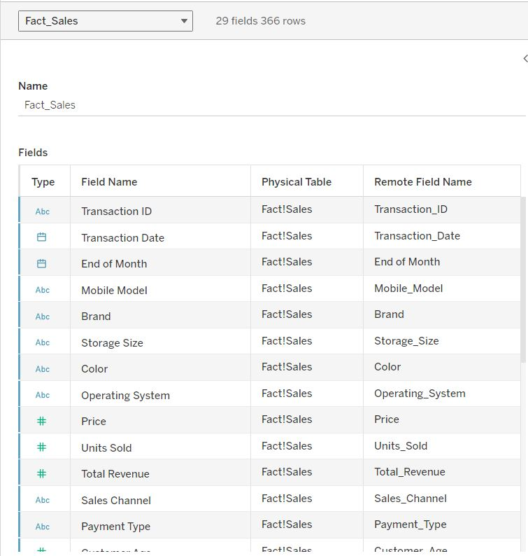
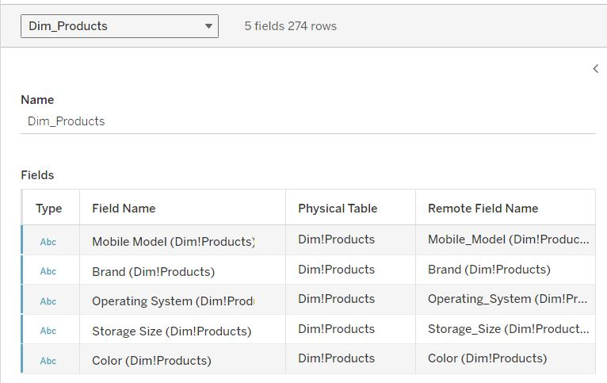
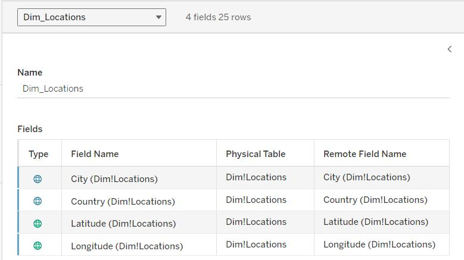
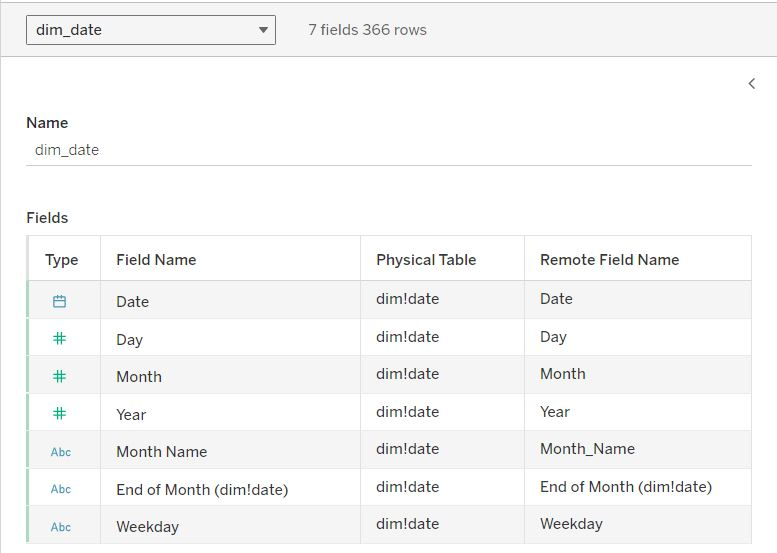
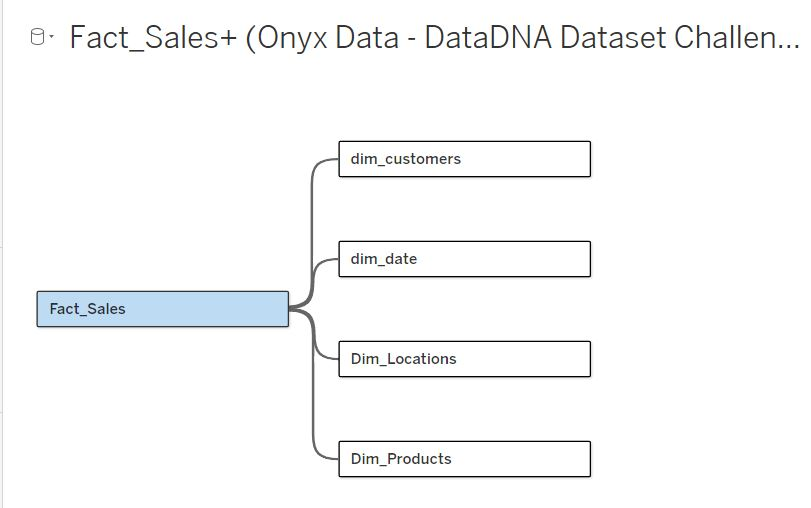
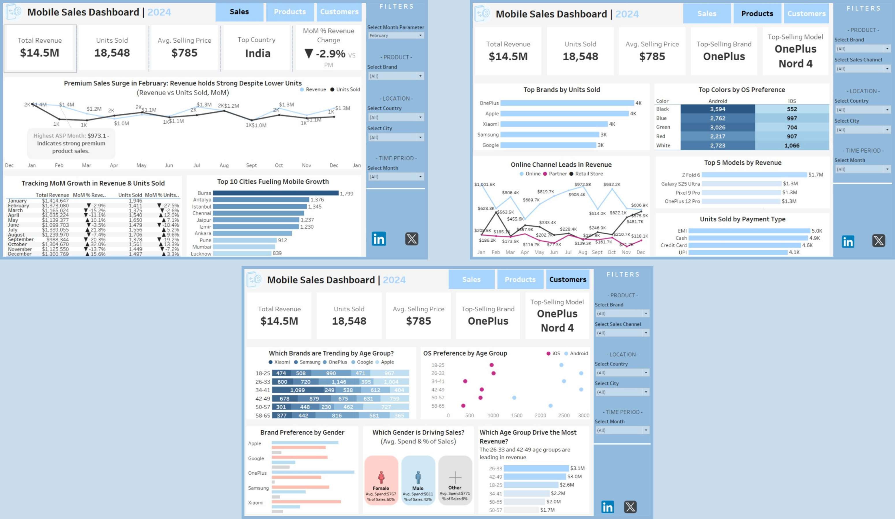
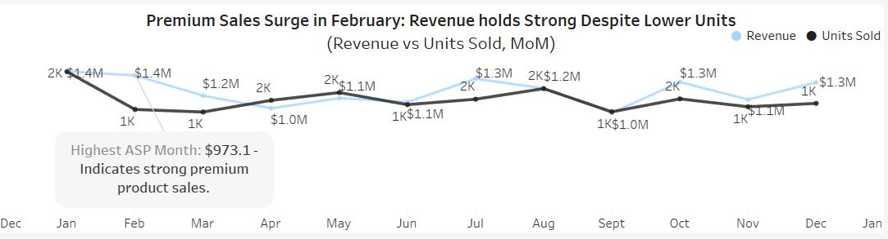
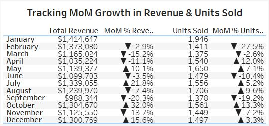
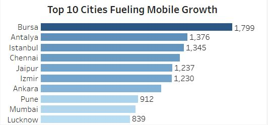

# Mobile-Sales-Analysis

### Project Background
As a data analyst at one of the leading mobile phone retailers in Asia and beyond, I support a fast-paced business that operates across multiple countries and urban centers. Our company has been active in the mobile retail industry for over a decade, building a trusted reputation for offering a wide range of devices — from flagship smartphones to budget-friendly models.
We operate a hybrid sales model that combines:
- **Online Sales Platforms**
- **Physical Retail Stores**
- **Third-Party Partner Channels**

This multi-channel approach allows us to reach diverse customer segments — from digital-first Gen Z buyers to walk-in customers in urban malls. Our key business metrics include **total revenue**, **units sold**, **average selling price (ASP)**, and **customer retention**.

In 2024, our goal has been to:
- **Expand our footprint across high-growth cities**
- **Improve inventory management by tracking top-selling models**
- **Refine customer targeting by better understanding buyer demographics and preferences**
- **Optimize channel performance between online, in-store, and partner sales**

This sales dataset provides a rich opportunity to uncover meaningful patterns, optimize marketing and supply chain efforts, and shape data-informed strategic decisions across the company.

Insights and recommendations are provided on the following key areas:

1. Sales Performance
2. Product Insights
3. Customer Behaviour

The following business questions were answered:
- Which mobile brands and models are the top sellers overall and in specific countries or cities?
- How do sales numbers vary by storage size, color, or operating system (Android vs. iOS)?
- What is the typical customer profile — age group, gender — for different brands or models?
- How do sales and revenues break down across different sales channels (online, partner, in-store) and payment types?
- Are there noticeable differences in pricing and sales volume between regions or cities?
- Which countries or cities generate the highest total revenue and units sold?
- Are there patterns in customer demographics based on mobile brand, model, or price range?
- How does sales performance change month over month in 2024?
- Are there correlations between customer age groups and the type of devices they purchase (for example, younger customers preferring certain brands)?

An interactive Tableau dashboard used to report and explore sales trends can be found here: 
[Mobile Sales Dashboard | 2024](https://public.tableau.com/views/MobileSalesDashboard2024/SalesDashboard?:language=en-US&:sid=&:redirect=auth&:display_count=n&:origin=viz_share_link)

### Data Structure & Initial Checks
The company's main database structure, as seen below, consists of one facts table, facts_sales, and 2 dimension tables: dim_products and dim_location, with a total row count of 367 records. A description of each table is as follows:

#### Facts_Sales: 

#### Dim_Products:

#### Dim_Locaton: 

I created two more dimension tables: dim_date, for time series analysis, and dim_customers.

#### Dim_Date:

#### Dim_Customers: 

#### Entity Relationship Diagram

## Executive Summary
### Overview of Findings
In 2024, mobile sales were driven by strong demand for premium Android devices, with a notable revenue surge in February across key urban markets. Younger age groups, particularly Millennials and Gen Z, showed distinct brand preferences and higher spending power, influencing both product and channel strategies. Online sales outperformed all other channels, highlighting a shift in customer behavior and the growing importance of digital engagement.

**Dashboard:** 

## Insights Deep Dive
### Sales Performance:
#### 🔍Premium Sales Surge in February — Revenue Held Strong Despite Lower Units
In **February 2024**, the business saw a standout trend: **mobile unit sales dropped sharply by 27.5%**, falling from **1,946 units in January to 1,411**, the **lowest monthly volume of the year**. Yet, **total revenue held nearly steady at $1.37M**, down just **2.9% from January’s $1.41M**. This anomaly signals a **significant spike in Average Selling Price (ASP)**, which reached **$973.10** — the **highest ASP of the year**.

This trend highlights a **shift toward high-end device purchases**, suggesting that targeted promotions, flagship product launches, or premium customer segments drove revenue despite declining volume.

📊 Supporting Evidence:
- **January vs February:**
  - Revenue: $1.41M → $1.37M (▼ 2.9%)
  - Units Sold: 1,946 → 1,411 (▼ 27.5%)
  - ASP ↑ to $973.10 — highest of the year

- **Compared to March:**
  - Revenue fell further to $1.17M (▼ 15.2%)
  - Units sold: 1,375 (▼ only 2.6%)
  - Suggests February was uniquely driven by **premium product sales**

- **October also saw a similar ASP-driven pattern:**
  - Revenue ↑ 32.0% while Units ↓ 13.3%
  - Another example of revenue growth not tied to higher volume

💡 **Takeaway:**
**Premium device sales can protect revenue even in low-volume months.** Replicating February’s success may involve:
- Releasing flagship models in Q1
- Offering high-margin bundles or loyalty upgrades
- Segmenting campaigns toward high-ASP demographics

Revenue holds strong despite February's unit dip — driven by premium device sales.

February's MoM drop in units sold contrasts with minimal revenue decline — ASP peaked at $973.10.

#### 🌍Regional Growth Spotlight: Cities Driving Mobile Sales
In 2024, mobile growth was largely driven by **urban powerhouses** across **Turkey** and **India**, with **Bursa leading all cities at 1,799 units sold**. Turkish cities dominated the leaderboard, securing **6 of the top 10 spots**, led by **Antalya (1,376)** and **Istanbul (1,345)** — highlighting a strong regional presence and possibly effective localized marketing or distribution strategies.

India also contributed significantly, with **Chennai (1,296)**, **Jaipur (1,237)**, and **Pune (912)** showing impressive sales volumes. This geographic trend signals high market penetration in metros and growing adoption in Tier-2 cities like **Lucknow (839)**.

💡 **Takeaway:**
To sustain growth, the business can:
- Double down on high-performing Turkish cities with targeted promotions
- Expand presence in Indian Tier-2 cities, where mobile demand is surging
- Analyze what’s working in Bursa and replicate those strategies in underperforming cities

Bursa leads the charge in mobile sales, with Turkish and Indian cities shaping 2024’s regional growth story.

