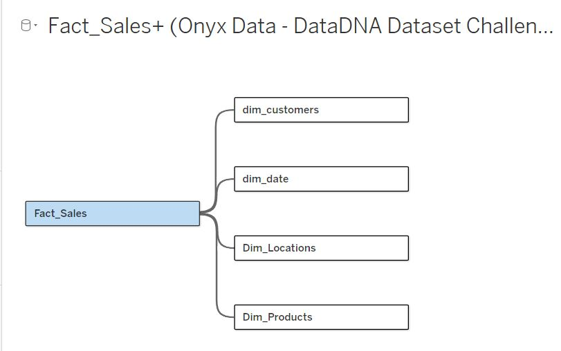

# Mobile-Sales-Analysis

### Project Background
As a data analyst at one of the leading mobile phone retailers in Asia and beyond, I support a fast-paced business that operates across multiple countries and urban centers. Our company has been active in the mobile retail industry for over a decade, building a trusted reputation for offering a wide range of devices — from flagship smartphones to budget-friendly models.
We operate a hybrid sales model that combines:
- **Online Sales Platforms**
- **Physical Retail Stores**
- **Third-Party Partner Channels**

This multi-channel approach allows us to reach diverse customer segments — from digital-first Gen Z buyers to walk-in customers in urban malls. Our key business metrics include **total revenue**, **units sold**, **average selling price (ASP)**, and **customer retention**.

In 2024, our goal has been to:
- **Expand our footprint across high-growth cities**
- **Improve inventory management by tracking top-selling models**
- **Refine customer targeting by better understanding buyer demographics and preferences**
- **Optimize channel performance between online, in-store, and partner sales**

This sales dataset provides a rich opportunity to uncover meaningful patterns, optimize marketing and supply chain efforts, and shape data-informed strategic decisions across the company.

Insights and recommendations are provided on the following key areas:

1. Sales Performance
2. Product Insights
3. Customer Behaviour

The following business questions were answered:
- Which mobile brands and models are the top sellers overall and in specific countries or cities?
- How do sales numbers vary by storage size, color, or operating system (Android vs. iOS)?
- What is the typical customer profile — age group, gender — for different brands or models?
- How do sales and revenues break down across different sales channels (online, partner, in-store) and payment types?
- Are there noticeable differences in pricing and sales volume between regions or cities?
- Which countries or cities generate the highest total revenue and units sold?
- Are there patterns in customer demographics based on mobile brand, model, or price range?
- How does sales performance change month over month in 2024?
- Are there correlations between customer age groups and the type of devices they purchase (for example, younger customers preferring certain brands)?

An interactive Tableau dashboard used to report and explore sales trends can be found here: 
[Mobile Sales Dashboard | 2024](https://public.tableau.com/views/MobileSalesDashboard2024/SalesDashboard?:language=en-US&:sid=&:redirect=auth&:display_count=n&:origin=viz_share_link)

### Data Structure & Initial Checks
The company's main database structure, as seen below, consists of one facts table, facts_sales, and 2 dimension tables: dim_products and dim_location, with a total row count of 367 records. A description of each table is as follows:

Facts_Sales: 
Dim_Products: 
Dim_Locaton: 

I created two more dimension tables: dim_date, for time series analysis, and dim_customers.

Dim_Date: 
Dim_Customers: 

### Entity Relationship Diagram

