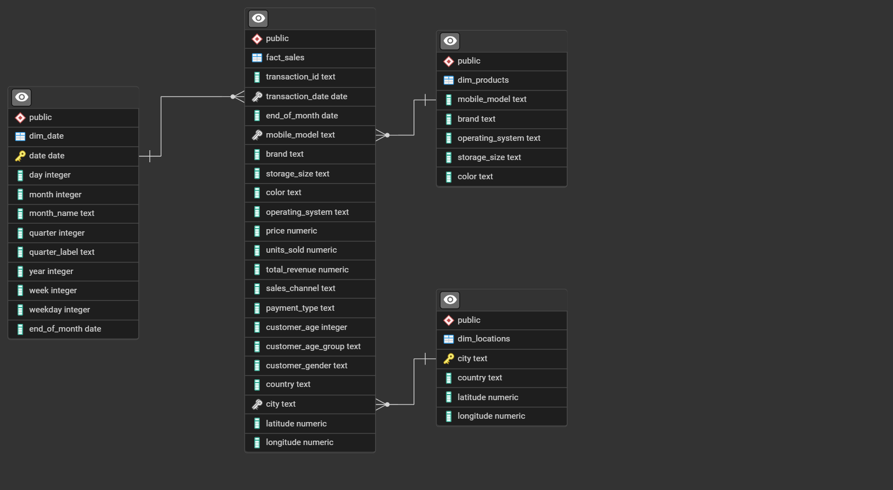
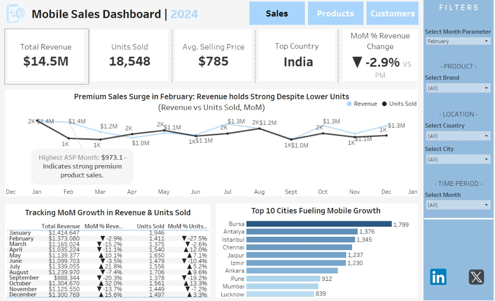
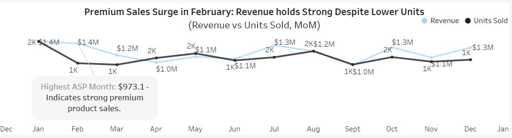
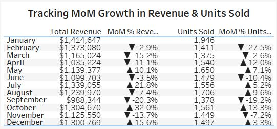
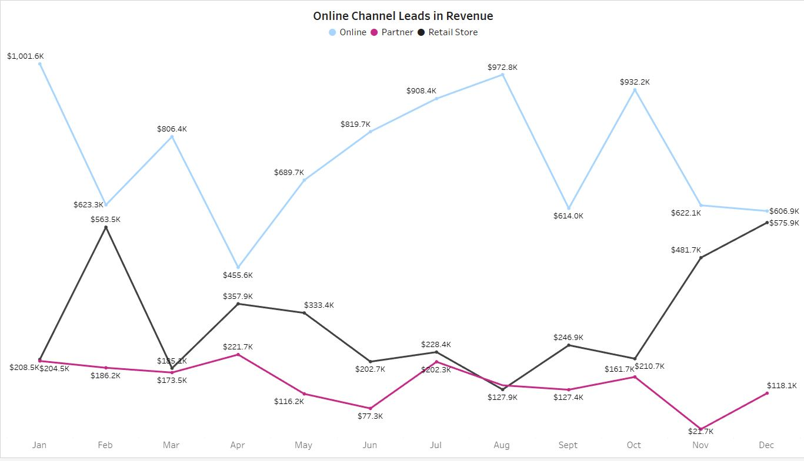
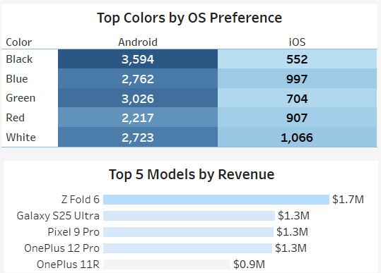
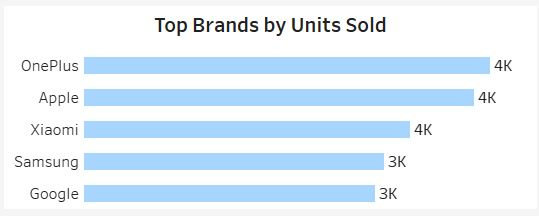
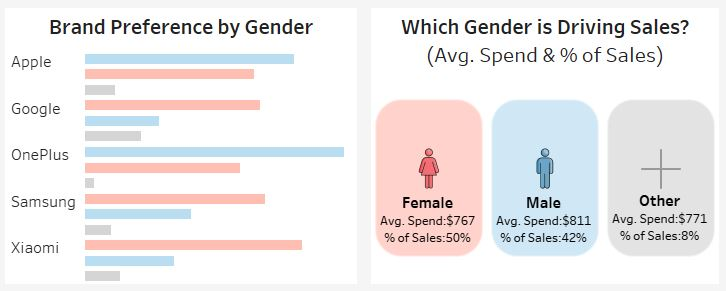
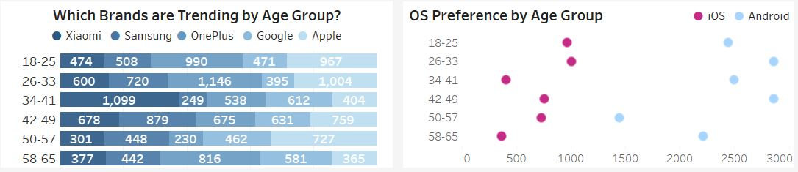
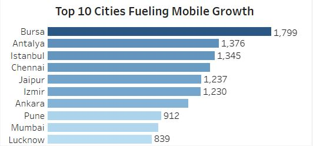

# Mobile-Sales-Analysis

## Project Background
Mobile Sales Dashboard is a data analysis project focused on uncovering key insights from a comprehensive 2024 sales dataset provided by a major mobile phone retailer operating across multiple countries. The company, whose name remains undisclosed, offers mobile phones through various sales channels including in-store purchases, online platforms, and third-party partners.

The dataset includes detailed records of transactions, customer demographics, product specifications, and geographic data. It captures valuable information such as device models, prices, storage sizes, colors, operating systems, customer age groups and genders, as well as sales channels and payment methods.

This project aims to analyze and visualize this data to identify trends, highlight high-performing products, and provide a deeper understanding of customer behavior. The resulting insights are intended to support strategic business decisions related to marketing, inventory management, and regional expansion.

Insights and recommendations are provided on the following key areas:
- **Sales Trends & Channel Performance:** Examination of sales activity across different channels (online, retail store, partner) and time periods, with a focus on revenue, volume, and seasonal patterns.
- **Product Performance Analysis:** Assessment of mobile phone models based on price, storage size, color, and operating system to determine the best-performing products.
- **Customer Behavior Insights:** Analysis of customer demographics, including age group and gender, to uncover purchasing patterns and segment preferences.
- **Regional Sales Breakdown:** Evaluation of geographic trends to identify top-performing regions and potential markets for growth.

An interactive Tableau dashboard used to report and visualize these findings and support data-driven business strategies can be found here: 
[Mobile Sales Dashboard | 2024](https://public.tableau.com/views/MobileSalesDashboard2024/SalesDashboard?:language=en-US&:sid=&:redirect=auth&:display_count=n&:origin=viz_share_link)

## Data Structure & Initial Checks
The company's main database structure as seen below, consists of one facts table, facts_sales, and 2 dimension tables: dim_products and dim_location, with a total row count of 367 records.

#### Entity Relationship Diagram

Prior to beginning the analysis, a variety of checks were conducted for quality control and farmilarization with the dataset. To support time-based analysis across multiple visualizations, a **dim_date** table was created using **Excel** and joined with the facts data.
**Purpose:**
 - Enables month, quarter, and year breakdowns.
 - Facilitates trend analysis and time-based comparisons.
 - Supports cleaner date filtering and grouping in Power BI/Tableau.
   
✅A relationship was created with the facts_sales data on the **date** field for all time-series visualizations and trend analysis.

## Executive Summary
### Overview of Findings
In 2024, the company’s mobile sales showed mixed performance, with steady overall revenue but notable fluctuations in monthly trends and unit sales. Key performance indicators (KPIs) reflect a competitive market influenced by consumer preference for premium devices and regional growth hotspots.

Total revenue for the year reached $14.5M, with 18,548 units sold at an average selling price (ASP) of $785. While overall performance was stable, a closer look at monthly data reveals critical insights.

Regionally, **India emerged as the top-performing country**, while **Bursa**, **Antalya**, and **Istanbul** led city-level mobile growth, collectively accounting for a significant share of total units sold.

Despite a **-2.9% MoM revenue dip in February**, revenue remained strong due to high-value sales. This trend shows the importance of targeting premium segments in top-performing regions.

Below is the overview page from the Tableau dashboard and more examples are included throughout the report. The entire interactive dashboard can be downloaded [here](https://public.tableau.com/views/MobileSalesDashboard2024/SalesDashboard?:language=en-US&:sid=&:redirect=auth&:display_count=n&:origin=viz_share_link)

## Key Insights
### Sales Performance:
- **February Premium Sales Surge**
   - Unit sales dropped 27.5% from 1,946 in January to 1,411 (lowest of the year).
   - Revenue only dipped 2.9%, from $1.41M to $1.37M.
   - Resulted in the **highest Average Selling Price (ASP) of the year: $973.10**.
   - This indicates a shift toward **high-end device purchases** — possibly due to premium launches, promotions, or targeting high-value customers.
- **February vs March**
   - **March revenue fell to $1.17M** (▼ 15.2% from January).
   - Units sold in March: 1,375 (▼ only 2.6% from February).
   - This suggests **February’s strong revenue was driven by higher-priced products**, not volume.
- **October Shows Similar ASP Trend**
   - **Revenue jumped 32.0%**, even though units sold dropped 13.3%.
   - Another sign that **premium products** can drive revenue growth, even with lower sales volume.

Revenue holds strong despite February's unit dip — driven by premium device sales.

February's MoM drop in units sold contrasts with minimal revenue decline — ASP peaked at $973.10.

### Sales Channel Performance:
- The **Online channel peaked in January** with revenue of **$1.001M**, followed by strong performances in **July ($972.8K)** and **October ($932.2K)**.
- The **Retail Store channel** showed a notable recovery, especially in Q4, climbing steadily from **$202.7K in June** to **$575.9K in December**, indicating growing foot traffic or successful end-of-year promotions.
- The **Partner channel underperformed**, with revenues declining to a low of **$21.7K in November**, before slightly rebounding in **December to $118.1K**. This highlights a potential need for re-evaluation of partnership strategies or incentives.

### Product Performance:
- **Over $5.9M in revenue was driven by just five models**, led by the Z Fold 6, Galaxy S25 Ultra, Pixel 9 Pro, OnePlus 12 Pro, and OnePlus 11R. These top performers together account for a significant portion of 2024 sales, highlighting strong consumer interest in high-end Android smartphones.
- In terms of color preferences, **Black dominated Android sales**, contributing to over **3,500 units sold**, while **White led iOS preferences with 1,066 units sold** — nearly double the iOS count for Black. Blue also performed well across both systems, especially for iOS.
- Three brands—OnePlus, Apple, and Xiaomi—each sold over 4,000 units, outpacing Samsung and Google by a full 1,000 units. This even split among the top performers highlights a highly competitive landscape, with OnePlus demonstrating strong momentum both in volume and premium model sales.

 

### Customer Behavior:
- **Gender-Based Insights:**
  - Females drive the majority of sales volume (50%) with an average spend of $767.
  - Males have a higher average spend ($811), contributing to 42% of total sales.
  - Others contribute 8% to sales, with an average spend of $771.
- **Brand Preferences:**
  - Females prefer **Google**, **Samsung**, and **Xiaomi**.
  - Males favor **Apple** and **OnePlus**, especially OnePlus.

- **Age Group Preferences:**
  - **OnePlus** is extremely popular among **26–33-year-olds**, with **1,146 units sold**.
  - Apple dominates among younger groups, especially 18–33-year-olds.
  - Samsung and Xiaomi are more popular among middle-aged and older groups (34–65).
  - Google shows steady but moderate popularity across all age groups

- **OS Preference:**
  - iOS (Apple) is preferred by younger users (18–33).
  - Android dominates among older age groups (34–65), indicating a generational divide in OS loyalty.
 
 

### 🌍Regional Performance: Cities Driving Mobile Sales
- **Bursa**, Turkey led all cities with **1,799 units sold** — the top-performing city in 2024.
- **Turkish cities dominated** the leaderboard with **6 of the top 10 spots**, including:
   - Antalya – 1,376 units
   - Istanbul – 1,345 units
   - This suggests strong regional presence and effective localized marketing or distribution.
- **India** showed strong performance in both metro and Tier-2 cities:
   - Chennai – 1,296 units
   - Jaipur – 1,237 units
   - Pune – 912 units
   - Lucknow – 839 units, signaling growing adoption in Tier-2 markets.
- Overall trend indicates **high market penetration in urban centers** and emerging opportunities in secondary cities.

## Recommendations
1. **Premium device sales can protect revenue even in low-volume months.** Replicating February’s success may involve:
  - Releasing flagship models in Q1
  - Offering high-margin bundles or loyalty upgrades
  - Segmenting campaigns toward high-ASP demographics
2. **Boost Online Channel Performance**
  - Since the online channel consistently outperforms others, invest more in digital marketing, SEO, and mobile-optimized user experiences.
  - Consider exclusive online promotions during Q1 and Q3, when revenue peaks.
3. **Re-evaluate Partner Channel Strategy**
  - The partner channel is underperforming, especially in Q4.
  - Review partner sales strategies or consider replacing underperforming partners with higher-performing affiliates or influencers.
4. **Gender-Specific Marketing**
  - Target females with promotional campaigns, as they contribute 50% of total sales and favor 
    Google, Samsung, and Xiaomi.
  - Males have a higher average spend, so consider upselling or bundling premium products (e.g., 
    Apple, OnePlus) in male-oriented campaigns.
  - Include inclusive marketing for the “Other” category to improve engagement and grow this 
    emerging segment.
5. **Age-Group Targeting**
  - **Personalize campaigns by age group**
    - 18–33: Focus on Apple and OnePlus with social media and influencer marketing.
    - 34–49: Emphasize Samsung and Xiaomi, highlighting value-for-money features.
    - 50+: Prioritize Xiaomi and Samsung, possibly with simplified messaging and customer support.
6. **Platform Optimization**
  - For iOS-preferred demographics (18–33), optimize user experience and ads for iOS apps and devices.
  - For Android-dominant age groups (34+), ensure compatibility and affordability of Android options.
7. **Strategic Product Placement**
  - Stock and promote OnePlus heavily among 26–33-year-olds, the highest buying group for the brand.
  - Bundle Google products with services or promotions to increase competitiveness in younger age groups.
8. **Regional Performance**
  - **Double Down on High-Performing Urban Centers**
    - Invest more in marketing, inventory, and promotions in top-performing cities like Bursa, 
      Antalya, Istanbul, and Chennai, where demand is already strong.
  - **Strengthen Localized Marketing in Turkey**
    - With **6 of the top 10 cities in Turkey**, tailor campaigns to Turkish cultural and regional 
      preferences to maximize conversion rates and maintain dominance.
  - **Expand Distribution in Tier-2 Indian Cities**
    - Cities like Lucknow and Pune show promising sales growth. Increase channel partnerships and 
      in-store visibility in these areas to capture rising demand.
  - **Leverage Success Patterns Across Similar Markets**
    - Apply strategies from high-performing cities to other regions with similar demographics or 
      economic profiles to drive expansion.
 - **Launch Regional Promotions & Flagship Events**
    - Introduce exclusive regional product launches or seasonal offers in top cities to maintain 
      customer excitement and competitive edge.

